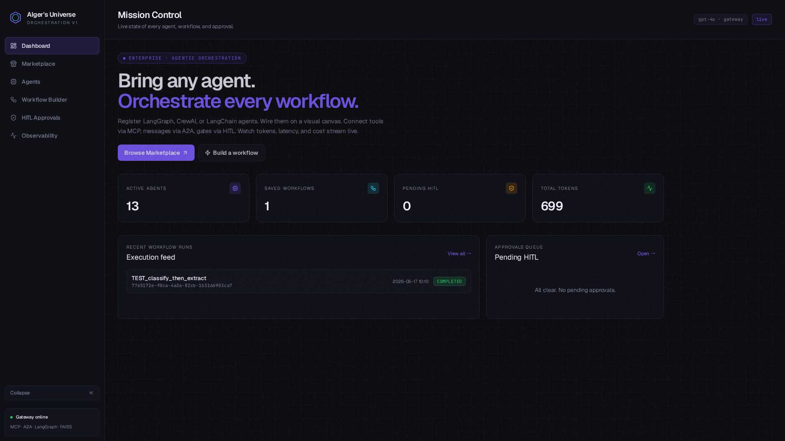
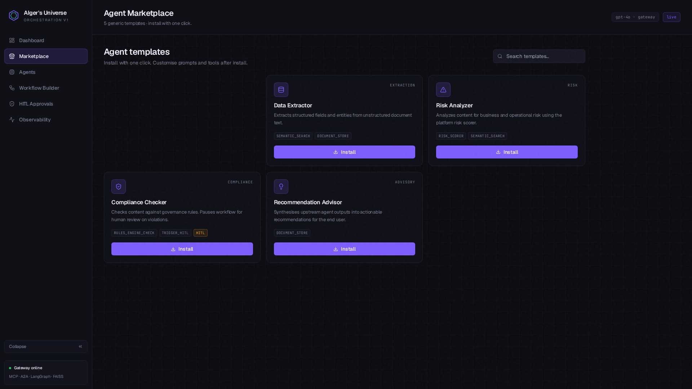
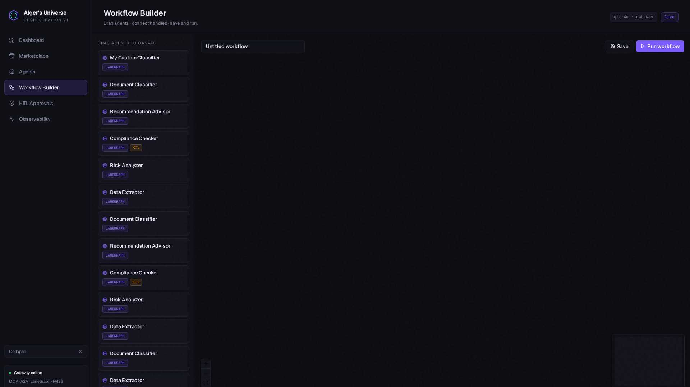
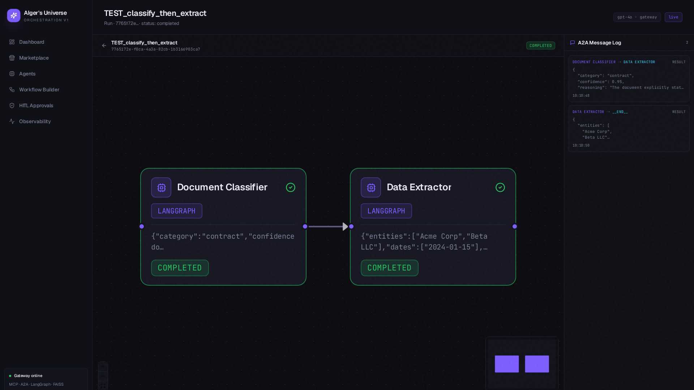
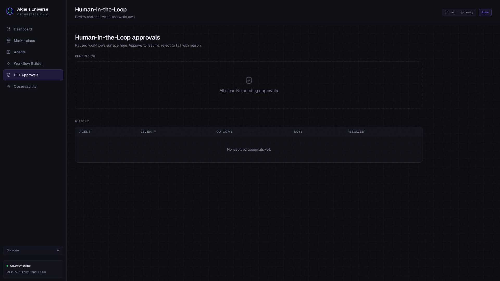
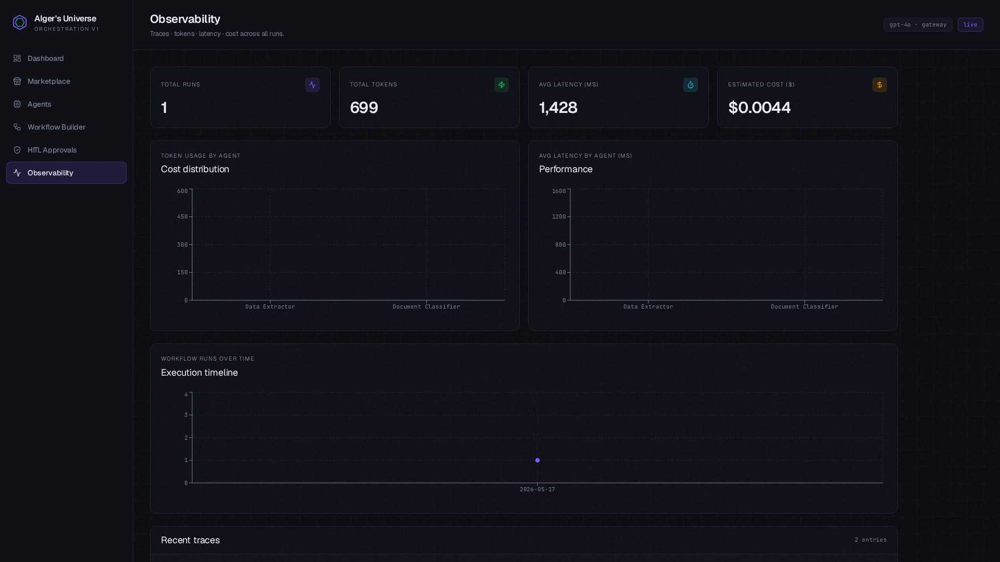

# AIger's Universe

> Enterprise AI Engineering & Agentic Orchestration Platform.
> Bring any agent. Orchestrate every workflow. Watch every token.

[](https://www.python.org/)
[](https://fastapi.tiangolo.com/)
[](https://react.dev/)
[](https://vitejs.dev/)
[](https://www.mongodb.com/)
[](https://github.com/facebookresearch/faiss)
[](https://www.langchain.com/)
[](https://www.langchain.com/langgraph)
[](https://www.crewai.com/)
[](https://github.com/agno-agi/agno)
[](https://modelcontextprotocol.io/)
[](https://github.com/jlowin/fastmcp)
[](https://github.com/google/A2A)
[](https://reactflow.dev/)
[](https://tailwindcss.com/)
[](https://platform.openai.com/)
[](#)
[](#)
[](LICENSE)


A generic, domain-agnostic and framework-agnostic platform for registering AI agents (LangGraph / CrewAI / LangChain / Agno), composing them into multi-agent workflows on a visual ReactFlow canvas, connecting them via **MCP** + **A2A**, gating them via **HITL**, and observing everything in real time.

## What's New

- JWT-backed sign-in with user and admin roles.
- Projects workspace for grouping related workflows.
- Project member sharing and shared workflow visibility by project.
- Agent code export for LangGraph, LangChain, CrewAI, Agno, and Langflow-style JSON.
- Framework-native runtime runners for LangGraph, LangChain, CrewAI, and Agno-style agents instead of one raw custom chat loop.
- Tool Playground for chat-style interaction with MCP tools, inspired by Langflow's Playground/Projects concepts.
- Knowledge-base uploads now support categories, broader text/code/document formats, and GitHub repository import for modernization-style use cases.
- MCP Studio now acts as the user-level surface for KB uploads, category-based knowledge organization, GitHub import, tool chat, and KB history.
- Workflow Builder now separates reusable KB context from run-scoped workflow inputs: text, uploaded files, and GitHub repo snapshots.
- Agent nodes now support per-node workflow input bindings so the same installed agent can see different inputs in different workflows.
- Official-doc tooling now includes Java, Python, Spring, and .NET adapters backed by live documentation search/fetch.
- Network-facing A2A endpoints now expose local agent cards and remote invoke routes for federated agent interoperability over HTTP.
- Agents page now includes a local agent-card helper section with one-click card URL copy for remote A2A setup.
- Remote A2A configuration now includes a "Test remote card" validation action before saving.
- Workflow Builder now includes an Orchestrator AI panel that can auto-compose a workflow from the user's prompt, install required Marketplace agents, and lay out the canvas automatically.
- Orchestrator planning details now open in a modal summary instead of crowding the sidebar, and auto-built workflows animate onto the canvas progressively.
- Planner review now supports `Accept`, `Edit`, `Replan`, and `Reject`, and accepted plans close the modal before slow-building the workflow onto the canvas.
- Workflow Builder upload and import actions now have independent loading states so file uploads and GitHub imports only animate when that exact action is running.
- Workflow Run now hides the global app header, expands the canvas, uses expandable A2A messages, and shows report-preparation states instead of surfacing premature report errors.
- Builder and run canvas now use guided node-focus transitions so the active step is visually centered during workflow construction and execution.
- Agent export and workflow reports now preserve stronger code-snippet coloring and more eye-catching highlighted sections.
- Workflow input retention, size limits, and startup cleanup are now configurable from env.
- Live web and realtime tooling now includes keyless Open-Meteo weather plus keyed SerpAPI and OpenWeather options.
- Per-user marketplace installed state.
- Admin-side project deletion from the control tower.
- In-app document preview modals and more operator-friendly toast/modal interactions.
- Agent model selection from the gateway model catalog.
- Mongo-backed workflow resume after interruption or backend restart.
- Migration marketplace now includes framework-native CrewAI and Agno templates for Java, Spring Boot, Python, Streamlit, React, Next.js, and .NET modernization tasks.

> **Yes — this _is_ a drag-and-drop application.** Open the **Workflow Builder** page and drag agent cards from the left rail onto the ReactFlow canvas to compose pipelines. The drag-and-drop is _specifically_ for orchestrating AI agents (not a general Bubble-style page builder).

For the full end-user walkthrough — concepts, prompts, **screenshots of every page**, best practices, page-by-page reference, API reference, and troubleshooting — read **[USER_GUIDE.md](./USER_GUIDE.md)**.

For a deep engineering breakdown of the full stack, execution model, data flow, MCP/A2A architecture, algorithms, market positioning, and commercial pitch, read **[Technical_architecture.md](./Technical_architecture.md)**.

For a full manual and platform-assisted end-to-end validation plan, read **[E2E_TESTING.md](./E2E_TESTING.md)**.

---

## Visual tour

| | |
|---|---|
|  |  |
| **Mission Control** — live KPIs + run feed | **Marketplace** — 30+ installable agent templates |
|  |  |
| **Workflow Builder** — drag-drop ReactFlow canvas | **Workflow Run** — SSE-driven live pipeline + A2A log |
|  |  |
| **HITL Approvals** — paused workflows + Approve/Reject | **Observability** — Recharts + traces |

---

## Tech stack

**Backend**: FastAPI · Motor (async MongoDB) · `fastmcp` (MCP) · `fastapi-mcp` (mount `/mcp`) · `python-a2a` · `langgraph` + `InMemorySaver` · `openai` (Tiger Analytics gateway, gpt-4o + text-embedding-3-small) · `faiss-cpu` · `PyMuPDF` + `python-docx` · `structlog`.

**Frontend**: Vite · React 18 · React Router 6 (v7 future flags on) · `reactflow` · `recharts` · `tailwindcss` (dark enterprise theme) · `lucide-react` · `sonner`.

**Storage**: MongoDB (`agents`, `workflow_definitions`, `workflow_runs`, `agent_traces`, `hitl_records`, `a2a_messages`, `documents`, `governance_rules`, `marketplace_templates`) + FAISS (`IndexFlatL2`, disk-persisted for KB only; workflow inputs stay DB-backed and run-scoped).

---

## Architecture

```
Vite/React (port 3000)
  ├── /dashboard /marketplace /agents
  ├── /builder (ReactFlow drag-drop)
  ├── /runs/:id (SSE-driven, A2A log)
  ├── /hitl /observability
  └── EventSource → /api/workflows/runs/:id/stream

FastAPI (port 8001, prefix /api)
  ├── /api/platform  (agent CRUD + invoke)
  ├── /api/workflows (defs · runs · SSE stream · report)
  ├── /api/hitl      (pending · approve · reject)
  ├── /api/observability (metrics · traces)
  ├── /api/marketplace (idempotent install + migration templates)
  ├── /api/documents (KB uploads/indexing + workflow-input uploads/cleanup)
  ├── /api/a2a       (agent cards + remote invoke)
  └── /mcp           (FastApiMCP SSE endpoint)

Engine:
  workflow_engine (LangGraph StateGraph + InMemorySaver)
   └── agent_registry → LLM tool-call loop → MCP tools
   └── tracer → MongoDB agent_traces
   └── a2a → MongoDB a2a_messages
   └── hitl_manager → MongoDB hitl_records + resume_signals
```

---

## Quick start — run it locally from VS Code

> **Prerequisites**
> - Python 3.11+ (3.12 OK)
> - Node.js 18+ (20 recommended)
> - MongoDB running locally on `mongodb://localhost:27017` (or a remote Atlas URI)
> - Tiger Analytics AI Gateway API key (OpenAI-compatible)
> - VS Code with the Python extension

### 1 · Clone
```bash
git clone https://github.com/yathik-2622/aigers-universe.git
cd aigers-universe
```

### 2 · Backend setup
```bash
cd backend
python -m venv .venv
source .venv/bin/activate          # Windows: .venv\Scripts\activate
pip install -r requirements.txt
cp .env.example .env                # then edit values (see table below)
```

Required `.env` values:

| Key | Example | Notes |
|---|---|---|
| `LLM_BASE_URL` | `https://api.ai-gateway.tigeranalytics.com` | OpenAI-compatible endpoint |
| `LLM_API_KEY` | `sk-...` | Your Tiger Analytics gateway key |
| `LLM_MODEL` | `gpt-4o` | Override if your gateway uses different ids |
| `EMBEDDING_MODEL` | `text-embedding-3-small` | 1536-dim |
| `MONGO_URL` | `mongodb://localhost:27017` | Local Mongo |
| `DB_NAME` | `aigers_universe` |  |
| `APP_HOST` | `0.0.0.0` |  |
| `APP_PORT` | `8001` | Locally any free port works |
| `CORS_ORIGINS` | `*` | Or comma-separated list of origins |
| `LOG_JSON_FORMAT` | `false` | `true` for production JSON logs |
| `JWT_SECRET` | `change-me-super-secret` | Required for login/session tokens |
| `ADMIN_EMAILS` | `admin@company.com` | Comma-separated admin emails |
| `GITHUB_TOKEN` | `ghp_...` | Optional. Public repo imports work without it, but rate limits are lower; private repo import needs it |
| `SERPAPI_KEY` | `...` | Required for `serpapi_search` |
| `OPENWEATHER_API_KEY` | `...` | Required for `openweather_current` |
| `A2A_SHARED_SECRET` | `shared-secret` | Optional shared secret for remote A2A card/invoke endpoints |
| `A2A_PUBLIC_BASE_URL` | `http://localhost:8001` | Public base URL used in generated agent cards |
| `OFFICIAL_DOCS_MAX_RESULTS` | `5` | Max results returned by official-doc adapters |
| `FAISS_INDEX_PATH` | `./vectorstore/data/faiss_index` | Created on first upload |
| `HITL_TIMEOUT_SECONDS` | `300` | Auto-reject if no human action within timeout |
| `WORKFLOW_INPUT_RETENTION_DAYS` | `7` | Retention period for run-scoped workflow inputs |
| `WORKFLOW_INPUT_MAX_FILES` | `6` | Max workflow input files attached to one run |
| `WORKFLOW_INPUT_MAX_TOTAL_BYTES` | `52428800` | Max aggregate workflow input upload size per run |
| `WORKFLOW_INPUT_MAX_TEXT_CHARS` | `120000` | Max text payload across workflow inputs per run |

Recommended values for a local setup:
- `GITHUB_TOKEN=` leave blank if you only import occasional public repos; add a fine-grained token for private repos or heavier usage.
- `A2A_SHARED_SECRET=change-this-local-a2a-secret` use any long random string if you want to protect remote A2A invoke/card access.
- `A2A_PUBLIC_BASE_URL=http://localhost:8001` for local development; in deployment use your public backend origin.
- `OFFICIAL_DOCS_MAX_RESULTS=5` is a good default. Increase only if you want more source candidates per docs search.
- `WORKFLOW_INPUT_RETENTION_DAYS=7` is a practical default for run-scoped uploads.
- `WORKFLOW_INPUT_MAX_FILES=6` is a good default for migration workflows.
- `WORKFLOW_INPUT_MAX_TOTAL_BYTES=52428800` equals 50 MB total workflow uploads per run.
- `WORKFLOW_INPUT_MAX_TEXT_CHARS=120000` keeps input payloads large enough for migration tasks without letting runs balloon uncontrollably.

Run the backend:
```bash
uvicorn server:app --reload --host 0.0.0.0 --port 8001
```
- Health: <http://localhost:8001/api/health>
- Swagger: <http://localhost:8001/docs>
- MCP: <http://localhost:8001/mcp>

### 3 · Frontend setup
Open a second terminal in VS Code:
```bash
cd frontend
cp .env.example .env                # edit VITE_REACT_APP_BACKEND_URL
yarn install                        # or: npm install
yarn start                          # or: npm run start
```

`.env`:
```env
VITE_REACT_APP_BACKEND_URL=http://localhost:8001
```

Frontend dev server: <http://localhost:3000>

### 4 · VS Code launch config (optional but nice)
Create `.vscode/launch.json`:
```json
{
  "version": "0.2.0",
  "configurations": [
    {
      "name": "Backend · uvicorn",
      "type": "debugpy",
      "request": "launch",
      "module": "uvicorn",
      "args": ["server:app", "--reload", "--host", "0.0.0.0", "--port", "8001"],
      "cwd": "${workspaceFolder}/backend",
      "envFile": "${workspaceFolder}/backend/.env",
      "jinja": true
    }
  ]
}
```

And `.vscode/tasks.json`:
```json
{
  "version": "2.0.0",
  "tasks": [
    {
      "label": "Frontend · vite",
      "type": "shell",
      "command": "yarn start",
      "options": { "cwd": "${workspaceFolder}/frontend" },
      "isBackground": true,
      "problemMatcher": []
    }
  ]
}
```

Then **F5** runs the backend with breakpoints; **Terminal → Run Task → Frontend · vite** runs the UI.

### 5 · First-time smoke test
```bash
# Health
curl -s http://localhost:8001/api/health

# Seeded marketplace
curl -s http://localhost:8001/api/marketplace/templates | jq '.count'

# Install a template (idempotent)
curl -s -X POST http://localhost:8001/api/marketplace/templates/tpl_data_extractor/install \
  -H 'Content-Type: application/json' -d '{}'

# Invoke the installed agent (verifies LLM gateway end-to-end)
AGENT_ID=$(curl -s http://localhost:8001/api/platform/agents | jq -r '.agents[0].agent_id')
curl -s -X POST http://localhost:8001/api/platform/agents/$AGENT_ID/invoke \
  -H 'Content-Type: application/json' \
  -d '{"input_data":{"text":"Contract dated 2024-03-15 between Acme Inc and Beta Corp for $50,000 services."}}' | jq
```

Expected: a JSON output with `entities`, `dates`, `amounts`, plus `tokens_used` and `latency_ms`.

### 6 · Run the platform tests
```bash
cd backend
pytest tests/test_platform_e2e.py -v
```

> The suite needs a live `LLM_API_KEY` because it executes a real workflow end-to-end. Use a test gateway or a low-quota key.

### 7 · Build the frontend for production
```bash
cd frontend
yarn build      # outputs dist/
yarn preview    # serves dist/ on port 3000 to verify
```

The `dist/` folder can be served by any static host (Nginx, S3+CloudFront, Vercel, Netlify). Point `VITE_REACT_APP_BACKEND_URL` at your production API before building.

---

## Sample `.env` files

### `backend/.env.example`
```env
LLM_BASE_URL=https://api.ai-gateway.tigeranalytics.com
LLM_API_KEY=replace-with-your-tiger-analytics-gateway-key
LLM_MODEL=gpt-4o
EMBEDDING_MODEL=text-embedding-3-small
MONGO_URL=mongodb://localhost:27017
DB_NAME=aigers_universe
APP_HOST=0.0.0.0
APP_PORT=8001
CORS_ORIGINS=*
LOG_LEVEL=INFO
LOG_JSON_FORMAT=false
JWT_SECRET=change-me-super-secret
ADMIN_EMAILS=admin@company.com
GITHUB_TOKEN=
SERPAPI_KEY=
OPENWEATHER_API_KEY=
A2A_SHARED_SECRET=
A2A_PUBLIC_BASE_URL=http://localhost:8001
OFFICIAL_DOCS_MAX_RESULTS=5
FAISS_INDEX_PATH=./vectorstore/data/faiss_index
HITL_TIMEOUT_SECONDS=300
WORKFLOW_INPUT_RETENTION_DAYS=7
WORKFLOW_INPUT_MAX_FILES=6
WORKFLOW_INPUT_MAX_TOTAL_BYTES=52428800
WORKFLOW_INPUT_MAX_TEXT_CHARS=120000
```

### `frontend/.env.example`
```env
VITE_REACT_APP_BACKEND_URL=http://localhost:8001
```

> The real `backend/.env` and `frontend/.env` are git-ignored — secrets never leak into the public repo.

---

## Project layout
```
.
├── backend/
│   ├── main.py · server.py
│   ├── config.py · logging_config.py
│   ├── api/             # 6 routers under /api/*
│   ├── core/            # llm_router · agent_registry · workflow_engine
│   ├── mcp_tools/       # FastMCP tool server (5 tools)
│   ├── a2a/             # python-a2a + Mongo audit
│   ├── hitl/            # interrupt/resume manager
│   ├── observability/   # tracer + aggregations
│   ├── vectorstore/     # FAISS (disk-persisted)
│   ├── middleware/      # request_id + structured log
│   ├── db/              # Motor client · seed · repositories
│   └── tests/
├── frontend/
│   ├── src/
│   │   ├── pages/        # Dashboard · Marketplace · Agents · Builder · Run · HITL · Observability
│   │   ├── components/   # layout · flow (ReactFlow) · common
│   │   ├── context/      # TitleContext
│   │   ├── api/          # axios + EventSource clients
│   │   ├── App.jsx · main.jsx · index.css
│   ├── vite.config.js
│   └── tailwind.config.js
├── docs/screenshots/    # PNG/JPEG previews used in USER_GUIDE.md
├── USER_GUIDE.md
└── README.md
```

---

## Notes
- **Auth**: not implemented — open access by design for the MVP. Wrap with your IDP / SSO before production.
- **Scaling HITL**: the engine uses `InMemorySaver`. Swap to `AsyncPostgresSaver` from `langgraph-checkpoint-postgres` if you need multi-replica HITL resume.
- **GitHub push**: use Emergent's **Save to GitHub** button in the chat input, or download the code and push manually (see USER_GUIDE for instructions).

---

## New APIs
- `POST /api/auth/login`
- `GET /api/auth/me`
- `GET /api/projects`
- `POST /api/projects`
- `GET /api/admin/overview`
- `POST /api/tool-chat/message`
- `POST /api/policies/upload`
- `GET /api/platform/models`
- `POST /api/workflows/auto-build`
- `GET /api/a2a/agents/cards`
- `GET /api/a2a/agents/{agent_id}/card`
- `POST /api/a2a/agents/{agent_id}/invoke`
- `POST /api/a2a/validate-card`

## Testing Flow
1. Start MongoDB, backend, and frontend.
2. Confirm health at `GET /api/health`.
3. Open Agents and use `Local agent cards` to copy a local card URL.
4. Click `New agent`, set `A2A mode = Remote`, paste that URL, click `Test remote card`, confirm the validation summary appears, then save.
5. Open Workflow Builder and test the Orchestrator AI panel with this modernization prompt:
   `Modernize this Java monolith into Spring Boot services, assess migration risk, and produce a phased remediation backlog.`
6. Click `Auto-build workflow`.
7. If the planner asks for missing agents, click `Install required agents and build workflow`.
8. Confirm the canvas is populated automatically with installed real agents and edges.
9. In Workflow Inputs, add:
   `text`: keep the modernization goal
   `files`: upload one Java file or design note
   `repo`: import a public GitHub repo snapshot
10. Click a node and confirm input bindings and A2A routing are editable.
11. Run the workflow and verify:
   the run starts successfully
   the node badges reflect A2A mode and input bindings
   the A2A log shows persisted messages
12. Test a contract-risk workflow from the same Orchestrator AI panel with this prompt:
   `Review this vendor contract for extraction, risk, compliance, and final approval recommendation.`
13. Click `Auto-build workflow` again and confirm a contract/risk pipeline is assembled.
14. Upload a contract PDF or DOCX in KB or workflow inputs, run the workflow, and verify the run completes or pauses for HITL if the compliance checker triggers.
15. Test official docs tools from MCP Studio:
   `java_docs_search` with "ExecutorService shutdown"
   `spring_docs_search` with "externalized configuration"
   `python_docs_search` with "asyncio task groups"
16. Optionally switch one workflow node to the remote-routed agent and confirm it still completes.
17. Test workflow-input cleanup with `POST /api/documents/workflow-input/cleanup`.

## License
MIT.
