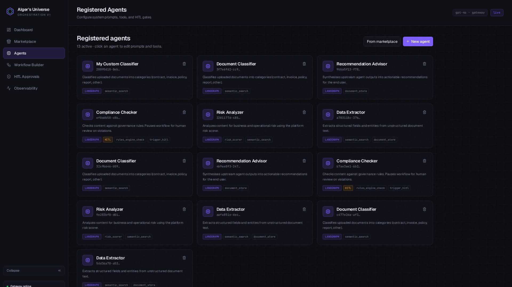

# AIger's Universe — Complete User Guide

> Enterprise AI Engineering & Agentic Orchestration Platform.
> Bring any agent. Orchestrate every workflow. Watch every token.

This guide takes you from cold start to a fully observable multi-agent run. On your first read-through, follow the steps in order; afterwards, jump to whichever section you need.

---

## What is AIger's Universe?

A generic, domain-agnostic platform that lets you:
- **Register** any AI agent (LangGraph / CrewAI / LangChain / Agno) with a name, framework, system prompt, and tool allow-list.
- **Compose** multi-agent workflows visually on a **ReactFlow drag-and-drop canvas**.
- **Connect** agents to platform tools via **MCP** (Model Context Protocol).
- **Communicate** between agents via **A2A** — every message is persisted as an audit trail, and agents can now expose HTTP agent cards and remote invoke endpoints for federated interoperability.
- **Gate** execution with **HITL** approvals (LangGraph `interrupt()` + `InMemorySaver`).
- **Observe** every run live: token usage, latency, cost, traces, A2A timeline.

> **Yes — it is itself a drag-and-drop app.** The Workflow Builder canvas is full ReactFlow. You drag agent cards from the library onto the canvas, wire them up with edges, and click Run.

---

## Table of contents
1. [Core concepts in 60 seconds](#core-concepts-in-60-seconds)
2. [MCP tools you can use today](#mcp-tools-you-can-use-today)
3. [Live URLs in this environment](#live-urls-in-this-environment)
4. [10-minute first run — illustrated](#10-minute-first-run--illustrated)
5. [Page-by-page reference](#page-by-page-reference)
6. [Best practices for great agent orchestration](#best-practices-for-great-agent-orchestration)
7. [Authoring your own agents from scratch](#authoring-your-own-agents-from-scratch)
8. [Document inputs, FAISS, and `semantic_search`](#document-inputs-faiss-and-semantic_search)
9. [HITL gates — when, how, and what to put in the prompt](#hitl-gates--when-how-and-what-to-put-in-the-prompt)
10. [Reading the Observability dashboard](#reading-the-observability-dashboard)
11. [API reference](#api-reference)
12. [Troubleshooting](#troubleshooting)
13. [Glossary](#glossary)
14. [JWT Auth, Projects, And Admin View](#jwt-auth-projects-and-admin-view)
15. [Tool Playground And Policy Uploads](#tool-playground-and-policy-uploads)

---

## Core concepts in 60 seconds
- **Agent** — an LLM persona with a system prompt, framework, and a list of tools it's allowed to call.
- **Tool** — a callable function exposed through MCP. Tools live on the platform side, not inside agents.
- **Workflow** — an ordered chain of agents on the canvas. Execution flows left → right by node X position.
- **Run** — one execution of a workflow. Has a unique `run_id`. Status: `running → completed | failed | paused`.
- **A2A message** — a structured payload one agent sends to the next (`result`, `context`, `delegation`, `alert`).
- **HITL gate** — a checkpoint where a human must approve before the workflow continues.
- **Trace** — one row per agent execution: tokens, latency, tools called, output.

---

## MCP tools you can use today

| Tool | What it does | Typical use |
|---|---|---|
| `semantic_search` | FAISS similarity over uploaded documents | "Find clauses about indemnity in the uploaded contract" |
| `knowledge_base_search` | Semantic retrieval over uploaded KB files and imported repo context | "Find current deployment constraints in my modernization KB" |
| `document_store` | CRUD on agent-owned MongoDB collections (`agent_data_*`) | Persist intermediate findings across agents |
| `rules_engine_check` | Runs text against seeded governance rules via LLM | PII / compliance / export-control sweeps |
| `policy_library_search` | Searches uploaded governance and policy material | "Find masking rules for customer identifiers" |
| `risk_scorer` | LLM scores 0–10 + RED/AMBER/GREEN with concerns | Risk triage on contract clauses, transactions |
| `wikipedia_search` | Fast public background research | "Summarise the strangler pattern" |
| `webpage_fetch` | Cleans official docs and public pages into text | "Fetch this vendor migration guide" |
| `weather_current` | Live weather via Open-Meteo, no key required | "Get current weather for Bangalore" |
| `openweather_current` | Live weather via OpenWeather | "Get rich weather details for New York" |
| `serpapi_search` | Live search-engine results via SerpAPI | "Find official Azure modernization docs" |
| `official_docs_search` | Live search across official Java, Python, Spring, and .NET docs | "Find official Spring Boot migration guidance" |
| `java_docs_search` | Oracle Java docs adapter | "Find Java concurrency migration notes" |
| `python_docs_search` | Python docs adapter | "Find `asyncio` task-group guidance" |
| `spring_docs_search` | Spring docs adapter | "Find Spring Boot externalized config docs" |
| `dotnet_docs_search` | .NET docs adapter | "Find ASP.NET dependency injection migration docs" |
| `remote_agent_discover` | Fetches a remote A2A agent card | "Inspect this remote modernization agent" |
| `remote_agent_dispatch` | Sends work to a remote A2A agent over HTTP | "Delegate repo classification to a remote agent" |
| `trigger_hitl` | Pauses workflow and creates an approval card | Compliance violations, dollar thresholds |

> Tools are LLM-driven. The model decides if and when to invoke them based on the agent's system prompt. Mention the tool by name in the prompt to nudge the model.

---

## Live URLs in this environment

| Surface | URL |
|---|---|
| Frontend | https://e349b436-dd11-41fa-876a-74ae285ee970.preview.emergentagent.com |
| API root | `${FRONTEND_URL}/api` |
| Health | `${FRONTEND_URL}/api/health` |
| Swagger | `${FRONTEND_URL}/docs` |
| MCP SSE endpoint | `${FRONTEND_URL}/mcp` |

---

## 10-minute first run — illustrated

### Step 0 · Land on the Dashboard
Open the frontend URL. You'll see Mission Control — your live state of agents, runs, and approvals.


What's on this page:
- **Hero** with CTAs to Marketplace and Builder.
- **4 KPI cards**: active agents · saved workflows · pending HITL · total tokens.
- **Recent runs** (last 8) with status badges.
- **Pending HITL queue** on the right.

The sidebar is **collapsible** (click the `«` Collapse button at the bottom). The logo is a transparent stacked-hexagon icon (lucide-react `Hexagon`).

---

### Step 1 · Install agent templates (1 min)
Click **Marketplace** in the sidebar.


You get a structured marketplace of 30+ installable templates across review, modernization, research, documentation, quality, governance, and migration use cases. The core starter set includes:
- **Document Classifier** — classifies content into categories.
- **Data Extractor** — pulls entities, dates, amounts, clauses.
- **Risk Analyzer** — scores content RED/AMBER/GREEN.
- **Compliance Checker** — rules engine + HITL-enabled.
- **Recommendation Advisor** — synthesises into priorities.

Click **Install** on a template. Install is **idempotent for default installs** — clicking twice returns the same agent (no duplicates). If you want a variant, install via the API with `custom_name`.

New migration-focused templates include framework-native CrewAI and Agno agents such as:
- **Java to Spring Boot Architect** (CrewAI)
- **Java to Python Service Translator** (Agno)
- **Streamlit to Next.js Experience Migrator** (Agno)
- **React to Next.js Upgrade Planner** (CrewAI)
- **.NET to Python API Migrator** (CrewAI)

---

### Step 2 · Inspect your agents
Click **Agents** in the sidebar.



Each agent card shows:
- Framework badge (LANGGRAPH / CREWAI / LANGCHAIN)
- HITL badge (if enabled)
- Tool chips (which MCP tools the agent can use)
- Trash icon for soft-delete (sets status=inactive)

Click **New agent** to register a completely custom agent (name, framework, description, system prompt ≥ 10 chars, tool allow-list, HITL toggle).

---

### Step 3 · Compose on the canvas
Click **Workflow Builder** in the sidebar.


The page has 3 zones:
- **Left rail** — your agent library (scrollable) + Workflow Inputs + Knowledge Base zones.
- **Center canvas** — ReactFlow drag-drop area with grid background, minimap, zoom controls.
- **Top bar** — workflow name input · **Save** · **Run workflow**.

**How to compose**:
1. Drag an agent card from the left rail onto the canvas.
2. A node appears with the agent's name, framework, HITL flag, and tool count.
3. Drag another agent next to it.
4. Hover the **right edge** of the first node until a dot appears → drag to the **left edge** of the second.
5. Click any node to open the right-side **Config Panel** for that agent — edit prompt / tools / HITL toggle, click **Save changes**.
6. Order matters — agents execute left → right by `position.x` on the canvas.

**Workflow inputs vs knowledge base**:
- **Workflow Inputs** are run-scoped. Add free text, upload files, or import a GitHub repo snapshot. These are stored in MongoDB and passed into the run without being indexed into the reusable KB.
- **Knowledge Base** content is reusable. KB uploads/imports are indexed and later searchable through `knowledge_base_search`.
- Each node can now choose which inputs it sees: text, uploaded files, workflow repo import, KB context, and upstream outputs.

When ready, give the workflow a name in the top input → **Save** → **Run workflow**.

---

### Step 4 · Watch live execution
After clicking Run, you're redirected to `/runs/{run_id}`.


What you see:
- **Topbar** dynamically updates with the workflow name, run id, status, and a **LIVE** badge while Server-Sent Events are streaming (falls back to 3-sec polling if SSE drops).
- **Center pipeline** — each agent node colour-coded:
  - Gray → pending
  - Indigo + pulse → running
  - Green → completed
  - Amber → paused (HITL)
  - Red → failed
- **A2A Message Log** on the right — every inter-agent payload streams in real time. Click to expand.
- **HITL banner** (amber) appears at the top if any agent paused for review.
- **View report** button appears when the run reaches `completed`.

---

### Step 5 · Handle a HITL approval
If an agent calls `trigger_hitl`, the workflow pauses. Click **HITL Approvals** in the sidebar.


Each pending card shows:
- Agent that triggered the pause
- HITL reason
- Severity badge (HIGH / MEDIUM / LOW)
- Context JSON (rich payload from the agent)
- Note field (required to reject)
- **Approve** (green) and **Reject** (red) buttons

Approve → workflow resumes from where it paused.
Reject → workflow is marked `failed` with your reason logged.

A **History** table below shows all resolved approvals with outcome + reviewer note + timestamp.

---

### Step 6 · Read Observability
Click **Observability** in the sidebar.


- **4 KPI cards**: total runs · total tokens · avg latency (ms) · estimated cost ($).
- **Token Usage by Agent** (Recharts bar) — shows your cost distribution.
- **Avg Latency by Agent** (Recharts bar) — shows your performance distribution.
- **Workflow Runs Over Time** (Recharts line) — daily run volume.
- **Recent traces** table — one row per agent execution with tokens, latency, tools called, status, and a deep-link back to the run page.

---

## Page-by-page reference

### Sidebar
- Collapsible (toggle at bottom). Width: `64` → `68px`. Preference saved in `localStorage`.
- Logo: transparent stacked `Hexagon` (lucide-react), no solid background.
- Pages: Dashboard · Marketplace · Agents · Workflow Builder · HITL Approvals · Observability.

### Header
- Auto-derives title/subtitle from the route.
- On `/runs/:runId` it dynamically reads the workflow name + run id + status from the run page (via `TitleContext`).
- Right side: `gpt-4o · gateway` model pill + `live` indicator.

### Dashboard
- Hero with CTAs to Marketplace and Builder.
- 4 KPI cards.
- Recent runs feed + pending HITL queue.

### Marketplace
- 30+ structured templates, search bar filters by name/description.
- Idempotent install — same agent_id returned on repeat clicks unless you pass `custom_name` / `custom_system_prompt`.

### Agents
- Lists all active agents (deactivated ones hidden).
- **New agent** modal for fully custom registration, including tags, A2A enablement, A2A mode (`local` or `remote`), and an optional remote agent card URL.
- The page now includes a **Local agent cards** section so operators can copy a local card URL with one click and paste it into a remote-routed agent setup.
- When `A2A mode` is `Remote`, the form and node config both include a **Test remote card** action so you can validate the target card before saving.
- Soft-delete via trash icon.

### Workflow Builder
- ReactFlow canvas with custom `AgentNode` (framework, HITL, tool count badges).
- Right-side **Config Panel** opens on node click and now includes per-node workflow input bindings plus A2A routing controls.
- Left rail: agent library + workflow inputs + KB controls + recent document picker.
- The new **Orchestrator AI** panel can read a user goal, select installed agents, suggest missing Marketplace agents, optionally install them, and lay out the workflow automatically.
- Planner details now appear in a dedicated modal summary, while the canvas itself animates the workflow build so the creation process feels visible instead of instant.
- The planner modal now supports `Accept`, `Edit`, `Replan`, and `Reject`. Accepting closes the modal and then slow-builds the workflow on canvas.
- Workflow input file uploads and GitHub imports now use separate action states, so only the active action shows loading feedback.
- Top bar: workflow name · Save · Run workflow.

### Workflow Run
- Live ReactFlow pipeline.
- SSE-driven with polling fallback.
- A2A message log on the right with expandable message cards.
- HITL banner on pause.
- View report modal on completion, with a preparation state if the final report is still being assembled.
- The active node is camera-focused during build-time and run-time progression so users can follow the current step visually.

### HITL Approvals
- **Pending** cards (amber) with Approve / Reject.
- **History** table.

### Observability
- 4 KPI cards · 3 Recharts (token bar, latency bar, timeline line) · recent traces table.

---

## Best practices for great agent orchestration

### Prompt shape
A solid agent system prompt has 4 parts:
1. **Role** — "You are a senior compliance officer."
2. **Task** — "Given a contract excerpt, identify regulatory violations."
3. **Tool guidance** — "When in doubt, call `rules_engine_check` with `rule_category='compliance'`. Call `trigger_hitl` with `severity='HIGH'` if you detect unredacted PII."
4. **Output schema** — "Respond ONLY in JSON: `{\"violations\": [...], \"status\": \"PASS\"|\"FAIL\"|\"REVIEW\"}`."

The platform auto-parses your JSON output. If it can't, it stores raw text in `output.text`.

### Pipeline shape
- **Top of funnel**: classifier or extractor (cheap, deterministic).
- **Middle**: analysers / scorers (use `risk_scorer`, `rules_engine_check`).
- **Bottom**: synthesiser / advisor (combines all upstream outputs).

### A2A discipline
- The platform automatically sends a `result` message from each agent to the next — you don't need to call `send_a2a_message` from your prompts.
- Want richer signalling? Ask your agent to emit a structured `alert` payload — the next agent will see it in its `UPSTREAM AGENT MESSAGES` block.
- For remote interoperability, each active agent can expose an A2A agent card at `/api/a2a/agents/{agent_id}/card` and a remote invoke endpoint at `/api/a2a/agents/{agent_id}/invoke`.

### Cost control
- Use a small classifier early to short-circuit cheap.
- Reserve the highest-temperature/largest model only for the final synthesiser.
- Watch the **Token Usage by Agent** chart — outliers are your tuning targets.

---

## Authoring your own agents from scratch

### From the UI
**Agents page → New agent** → fill the form → Register. The agent appears in the Builder library immediately.

### From the API
```bash
curl -X POST "$BASE/api/platform/agents" -H "Content-Type: application/json" -d '{
  "name": "Contract Indemnity Analyzer",
  "framework": "langgraph",
  "description": "Identifies and scores indemnity clauses.",
  "system_prompt": "You are an M&A lawyer specialising in indemnity. ...",
  "tools": ["semantic_search", "risk_scorer"],
  "hitl_enabled": false
}'
```

Update the prompt later:
```bash
curl -X PUT "$BASE/api/platform/agents/$AGENT_ID" -H "Content-Type: application/json" -d '{
  "system_prompt": "...new prompt...",
  "tools": ["semantic_search", "risk_scorer", "rules_engine_check"]
}'
```

Test the agent in isolation:
```bash
curl -X POST "$BASE/api/platform/agents/$AGENT_ID/invoke" -H "Content-Type: application/json" -d '{
  "input_data": {"text": "Acme shall indemnify Beta for all third-party claims..."}
}'
```

---

## Document inputs, FAISS, and `semantic_search`
1. Upload via **Builder → Upload** or `POST /api/documents/upload`.
2. Text is extracted (PyMuPDF for PDF, python-docx for DOCX, raw for TXT).
3. Text is chunked at 1000 chars with 200-char overlap.
4. Each chunk is embedded via `text-embedding-3-small` and added to FAISS `IndexFlatL2`.
5. The FAISS index is persisted to `backend/vectorstore/data/faiss_index.*`.
6. When an agent calls `semantic_search(query, top_k=5)`, the tool embeds the query and returns the top-k chunks with similarity scores + metadata (document_id, filename, chunk_index).

> Tip: mention "use `semantic_search` to ground your answer" in the system prompt to ensure the model retrieves before reasoning.

---

## HITL gates — when, how, and what to put in the prompt
To make an agent pause for human review on certain conditions:

1. Add `trigger_hitl` to the agent's tool allow-list.
2. (Optional) Set `hitl_enabled = true` on the agent for clarity in the UI.
3. In the system prompt, tell the model exactly when to call `trigger_hitl`:
   ```
   If `rules_engine_check` returns any rule with severity='HIGH' that is_violated,
   call trigger_hitl with severity='HIGH' and a one-sentence reason that includes
   the rule_name.
   ```
4. When the model calls the tool:
   - A `hitl_records` row is inserted (`status: pending`).
   - The workflow run is set to `status: paused`.
   - The Run page shows an amber banner and the paused node turns amber.
5. Reviewer opens **HITL Approvals**, reads reason + context, adds a note, clicks **Approve** or **Reject**.
6. Workflow resumes from where it paused (LangGraph state restored from `InMemorySaver`).

Timeout: if no decision lands within `HITL_TIMEOUT_SECONDS` (default 300s), the workflow is auto-rejected for safety.

---

## Reading the Observability dashboard

### Metric cards
- **Total runs** — count of `workflow_runs` documents.
- **Total tokens** — sum of `tokens_used` across all `agent_traces`.
- **Avg latency (ms)** — mean of `latency_ms` per trace.
- **Estimated cost ($)** — blended at $6.25 / 1M tokens (mid-point of gpt-4o input/output). Override in `backend/observability/tracer.py` if your gateway charges differently.

### Token Usage by Agent
Bar chart, descending. Tells you which agent dominates cost.

### Avg Latency by Agent
Bar chart. Slow agents are usually verbose-prompt agents — trim the system prompt or split into two stages.

### Workflow Runs Over Time
Line chart by date. Useful for spotting traffic spikes.

### Recent traces table
Click the run id to jump back into the live run page.

---

## API reference (all under `/api`)

| Method | Path | Purpose |
|---|---|---|
| GET    | /health                                | Platform health |
| POST   | /platform/agents                       | Register an agent |
| GET    | /platform/agents                       | List active agents |
| GET    | /platform/agents/{id}                  | Get agent |
| PUT    | /platform/agents/{id}                  | Update agent |
| DELETE | /platform/agents/{id}                  | Soft-delete |
| POST   | /platform/agents/{id}/invoke           | Invoke agent directly |
| GET    | /platform/tools                        | List MCP tool names |
| POST   | /workflows                             | Create workflow definition |
| POST   | /workflows/auto-build                  | Auto-compose a workflow from installed agents + Marketplace |
| GET    | /workflows                             | List workflows |
| GET    | /workflows/{id}                        | Get definition + canvas |
| POST   | /workflows/{id}/run                    | Start a run (async) |
| GET    | /workflows/runs/all                    | List recent runs |
| GET    | /workflows/runs/{run_id}               | Live snapshot + A2A messages |
| GET    | /workflows/runs/{run_id}/stream        | **SSE** stream of run state |
| GET    | /workflows/runs/{run_id}/report        | Final report (after completion) |
| GET    | /hitl/pending                          | Pending approvals |
| GET    | /hitl/all                              | All HITL records |
| POST   | /hitl/{id}/approve                     | Approve + resume |
| POST   | /hitl/{id}/reject                      | Reject + fail |
| GET    | /observability/metrics                 | Aggregate metrics |
| GET    | /observability/traces                  | Recent traces |
| GET    | /observability/traces/{run_id}/full    | Full per-run traces |
| POST   | /documents/upload                      | Upload PDF/DOCX/TXT |
| POST   | /documents/workflow-input/upload       | Upload run-scoped workflow input file |
| POST   | /documents/workflow-input/import-github| Import run-scoped GitHub repo snapshot |
| POST   | /documents/workflow-input/cleanup      | Cleanup expired workflow inputs |
| GET    | /documents                             | List documents |
| GET    | /marketplace/templates                 | List templates |
| POST   | /marketplace/templates/{id}/install    | **Idempotent** install |
| GET    | /a2a/agents/cards                      | List local A2A agent cards |
| GET    | /a2a/agents/{agent_id}/card            | Get one local A2A agent card |
| POST   | /a2a/agents/{agent_id}/invoke          | Remotely invoke a local agent |
| POST   | /a2a/validate-card                     | Validate a remote A2A card URL before saving |
| —      | /mcp                                   | MCP SSE endpoint (FastApiMCP) |

---

## Troubleshooting

| Symptom | Cause / Fix |
|---|---|
| Backend won't start | `tail -n 100 /var/log/supervisor/backend.err.log` — usually missing env or DB unreachable |
| `401` from LLM | `LLM_API_KEY` invalid — replace in `backend/.env`, restart backend |
| `Agent invocation failed: insufficient quota` | Gateway out of credits — top up |
| FAISS returns empty | Upload at least one document first |
| HITL not pausing | Agent must (a) have `trigger_hitl` in `tools` AND (b) prompt must instruct it to call the tool |
| Workflow stuck `running` | Check run status — if an agent threw, status flips to `failed` with `failure_reason` |
| ReactFlow canvas blank | Hard refresh (CSS not loaded) |
| SSE drops randomly | Frontend auto-falls back to 3s polling — no action needed |
| Duplicate agents | Old data — `POST /api/marketplace/templates/{id}/install` is now idempotent for default installs |
| Sidebar won't collapse | Refresh once to pick up the latest build; preference is stored in `localStorage` (`aigers.sidebar.collapsed`) |

---

## Glossary

## JWT Auth, Projects, And Admin View

- Sign in from `/login` with your name and work email. The backend now returns a bearer token and uses it to scope documents, agents, workflows, runs, traces, and HITL records.
- Users whose email appears in `ADMIN_EMAILS` are elevated to the `admin` role and can open `/admin` for full-platform visibility.
- Use `/projects` to group multiple workflows under a shared project context before saving or running them.
- The workflow builder stores the selected `project_id` with the workflow definition so future runs stay associated with the same workspace.
- Project owners can edit member emails from the Projects page, and invited users gain shared access to project workflows and runs.
- Admin users can delete projects from the Admin View when cleanup is required; workflows and runs are detached instead of destroyed.
- Dashboard and Builder now let users open uploaded documents in a rich preview modal so extracted content can be reviewed without leaving the platform.
- Knowledge-base ingestion now supports category-tagged uploads and GitHub repository import for repo-context and modernization workflows.

## Tool Playground And Policy Uploads

- `/tools-chat` is the dedicated MCP Studio for KB uploads, category-based knowledge history, GitHub import, tool testing, and operator prompts.
- You can let the backend auto-select a tool or force a specific safe tool such as `policy_library_search`, `rules_engine_check`, `risk_scorer`, `serpapi_search`, or `webpage_fetch`.
- KB uploads belong in MCP Studio or the KB section of the builder. Workflow Inputs are separate and are meant for run-specific payloads.
- If an agent should use policy or repo context directly, enable `knowledge_base_search`, `policy_library_search`, `webpage_fetch`, or `serpapi_search` on that agent from Agents or the node config panel.
- Each tool card now explains when to use the tool, what input to provide, what output to expect, and offers example prompts for operators.
- The Agents page can export each registered agent as LangGraph, LangChain, CrewAI, Agno, or Langflow-style code/JSON for review and download.
- The chat pane in Tool Playground stays fixed while the tool guide column scrolls, and the chat composer can upload documents for search-oriented tool workflows.
- Tool Playground also tracks user-level KB upload history and can import public GitHub repositories into the searchable knowledge base. Public repos work without `GITHUB_TOKEN`; private repos and higher rate limits need it.

## Environment Guidance

- `GITHUB_TOKEN`
  Keep blank if you only need light public-repo import usage.
  Use a fine-grained GitHub personal access token if you want private repo import or more resilient public-repo rate limits.
  Create it from GitHub: `Settings -> Developer settings -> Personal access tokens -> Fine-grained tokens`.
  Recommended permissions: repository `Contents: Read-only`, `Metadata: Read-only`.

- `A2A_SHARED_SECRET`
  Use any long random string, for example `change-this-local-a2a-secret`.
  Keep the same value across backends that should trust each other for remote A2A invoke.

- `A2A_PUBLIC_BASE_URL`
  Local: `http://localhost:8001`
  Deployment: your public backend origin, for example `https://your-domain.com`
  This value is used when the backend generates agent card URLs.

- `OFFICIAL_DOCS_MAX_RESULTS`
  Recommended: `5`
  Increase only if you want broader docs recall at the cost of more fetched references.

- `WORKFLOW_INPUT_RETENTION_DAYS`
  Recommended: `7`
  Use a shorter value if workflow uploads should expire faster.

- `WORKFLOW_INPUT_MAX_FILES`
  Recommended: `6`
  Good balance for migration workflows that need a few source files plus a repo snapshot.

- `WORKFLOW_INPUT_MAX_TOTAL_BYTES`
  Recommended: `52428800`
  This is 50 MB total workflow uploads per run.

- `WORKFLOW_INPUT_MAX_TEXT_CHARS`
  Recommended: `120000`
  Good default for large migration prompts without letting runs become uncontrolled.

## Exact Test Flow

1. Set backend env values.
   Keep `GITHUB_TOKEN` blank if you only test public repo import.
   Set `A2A_SHARED_SECRET=change-this-local-a2a-secret`.
   Set `A2A_PUBLIC_BASE_URL=http://localhost:8001`.
   Keep the other new values at their documented defaults.

2. Start services.
   Backend: `uvicorn server:app --reload --host 0.0.0.0 --port 8001`
   Frontend: `yarn start`

3. Verify the backend.
   Open `GET /api/health`
   Open `GET /api/a2a/agents/cards`

4. Install migration templates.
   From Marketplace, install:
   `Java to Spring Boot Architect`
   `Java to Python Service Translator`
   `Streamlit to Next.js Experience Migrator`

5. Create a custom remote agent from Agents.
   Open `Agents -> New agent`
   In the `Local agent cards` panel, copy a card URL from an existing local agent
   Choose any framework
   Turn `A2A enabled` on
   Set `A2A mode` to `Remote`
   Paste the copied card URL like `http://localhost:8001/api/a2a/agents/<some-local-agent-id>/card`
   Register it

6. Build a workflow.
   Add two nodes.
   On node 1, keep all workflow input bindings enabled.
   On node 2, disable `Knowledge base context` and `Uploaded files`.
   Optionally switch node 2 to `Remote A2A agent route` in the node config panel.

7. Add workflow inputs.
   Enter a migration prompt in the text box.
   Upload one file.
   Import one public GitHub repo.
   Optionally add KB uploads separately.

8. Run the workflow.
   Confirm the run page shows node statuses.
   Confirm the A2A log is populated.
   If a node is remote-routed, confirm it still completes and the tool list shows remote dispatch behavior in traces.

9. Test official docs tools.
   In MCP Studio, run:
   `java_docs_search` with `ExecutorService shutdown`
   `spring_docs_search` with `configuration properties`
   `python_docs_search` with `asyncio task groups`
   `dotnet_docs_search` with `dependency injection`

10. Test cleanup.
   Call `POST /api/documents/workflow-input/cleanup`
   Confirm the response shows deleted count and retention days.

## UI-Only Scenario Tests

### Scenario 1: Modernization orchestration

1. Open `Marketplace` and make sure at least some modernization agents are installed. If not, the builder can install them for you.
2. Open `Workflow Builder`.
3. In the `Orchestrator AI` panel, paste:
   `Modernize this Java monolith into Spring Boot services, assess migration risk, and produce a phased remediation backlog.`
4. Click `Auto-build workflow`.
5. If the panel shows missing agents, click `Install required agents and build workflow`.
6. Confirm the canvas auto-populates with a real multi-agent pipeline.
7. In `Workflow Inputs`, add:
   text describing the target runtime and timeline
   one uploaded file such as a Java class, architecture note, or migration checklist
   one public GitHub repo import if available
8. Optionally add KB context in the `Knowledge base` section for reusable architecture docs.
9. Click a node and verify the input bindings match the workflow goal.
10. Run the workflow.
11. On the run page, verify:
   the A2A log is populated
   modernization agents execute in order
   the final report includes migration phases, risk, and remediation guidance

### Scenario 2: Contract risk workflow

1. Open `Workflow Builder`.
2. In the `Orchestrator AI` panel, paste:
   `Review this vendor contract for key extraction, operational risk, compliance issues, and a final approval recommendation.`
3. Click `Auto-build workflow`.
4. Confirm the planner assembles a contract-oriented flow using extraction, risk, compliance, and recommendation agents.
5. Upload a contract PDF, DOCX, or text file in either the workflow input section or KB section depending on whether it is run-specific or reusable.
6. Run the workflow.
7. On the run page, verify:
   the extractor output appears upstream
   the risk analysis is present
   compliance can trigger HITL if a high-severity issue is found
   the final recommendation consolidates the earlier findings

### Scenario 3: Remote A2A routing from UI only

1. Open `Agents`.
2. In `Local agent cards`, copy a card URL for any local agent.
3. Click `New agent`.
4. Enable A2A, choose `Remote`, paste the copied URL, and click `Test remote card`.
5. Confirm the validation summary appears before saving.
6. Save the remote-routed agent.
7. Open `Workflow Builder` and drag that agent onto the canvas.
8. Run a workflow containing that node and confirm the run still completes while the A2A log shows remote delegation activity.

### Scenario 4: Project-scoped orchestration

1. Open `Projects` and create a new project such as `Modernization Wave 1`.
2. Add one or more member emails if you want to validate shared project visibility.
3. Open `Workflow Builder`.
4. In the `Project scope` dropdown, select the new project.
5. Build a workflow manually or through `Orchestrator AI`.
6. Save the workflow.
7. Confirm that reopening the builder or run pages keeps the workflow associated with that project.
8. Open `Observability` and `Projects` to verify the run appears under the same project context.
- **MCP** — Model Context Protocol. Open spec for exposing tools to LLM agents. We use `fastmcp` + `fastapi-mcp`.
- **A2A** — Agent-to-Agent. Google's open spec for inter-agent messaging. We use `python-a2a` for descriptors + Mongo for the message bus.
- **LangGraph** — Stateful graph orchestration over LangChain. We use it for the workflow chain + `interrupt()`/`Command` HITL resume.
- **InMemorySaver** — LangGraph checkpointer kept in memory. Fine for single replica; switch to `AsyncPostgresSaver` for HA.
- **FAISS** — Facebook AI similarity search. `IndexFlatL2` is exact, good up to ~100k vectors.
- **SSE** — Server-Sent Events. One-way HTTP stream we use for live run updates.
- **HITL** — Human-in-the-Loop. A pause-and-approve gate inside a workflow.
